# KotlinDesignPatterns
Kotlin设计模式

简单工厂：
定义一个工厂类，它可以根据参数的不同返回不同类的实例。

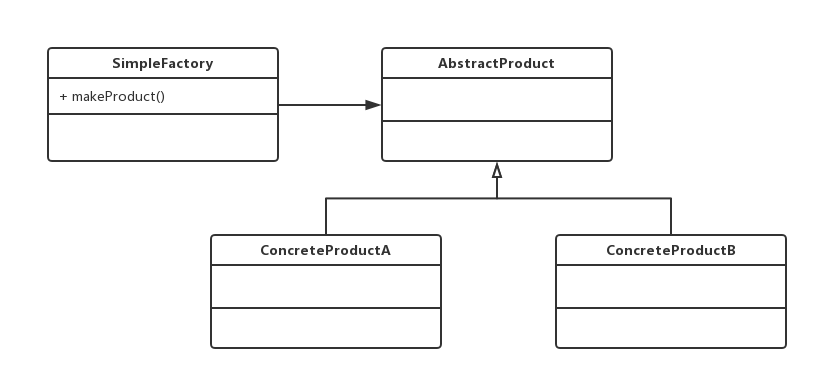

[SimpleFactory.kt](/src/com/huangyu/factory/SimpleFactory.kt)
---

工厂方法：
工厂方法把创建对象的过程抽象为接口，由工厂的子类决定对象的创建。

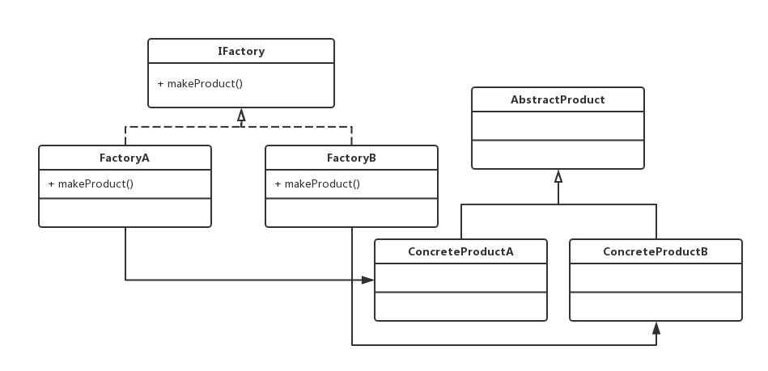

[FactoryMethod.kt](/src/com/huangyu/factory/FactoryMethod.kt)
---

抽象工厂：
工厂方法针对一种产品，而抽象工厂是针对一系列产品，为每种产品定义一个工厂方法，工厂子类负责创建该系列的多种产品。

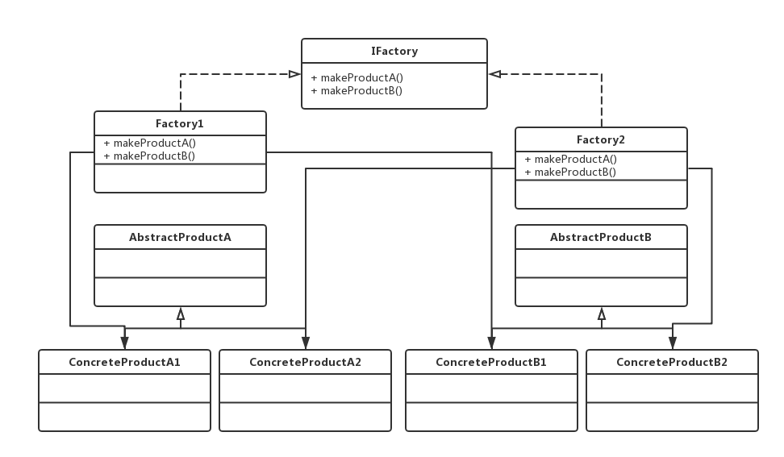

[AbstractFactory.kt](/src/com/huangyu/factory/AbstractFactory.kt)
---

单例：
单例模式在Kotlin下直接使用object就行了。

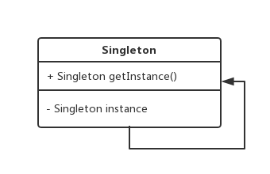

[Singleton.kt](/src/com/huangyu/singleton/Singleton.kt)
---

建造者：
建造者模式是为了构建复杂对象的，一般情况下，Kotlin中使用标准的apply函数就可以。

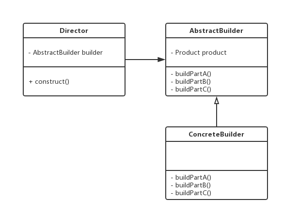

[Builder.kt](/src/com/huangyu/builder/Builder.kt)
---

原型：
原型模式是以一个对象为原型，创建出一个新的对象，在Kotlin下很容易实现，用data class的copy就可以。

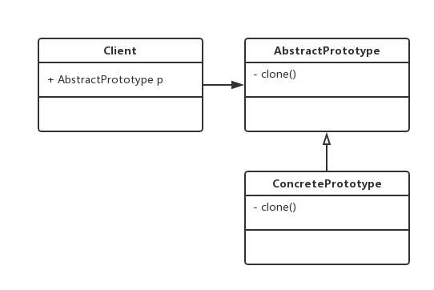

[Prototype.kt](/src/com/huangyu/prototype/Prototype.kt)
---

适配器：
适配器模式是把一个不兼容的接口转化为另一个类可以使用的接口。

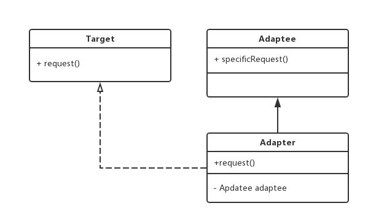

[Adapter.kt](/src/com/huangyu/adapter/Adapter.kt)
---

桥接：
桥接模式可以分离某个类存在两个独立变化的纬度，把多层继承结构改为两个独立的继承结构，在两个抽象层中有一个抽象关联。

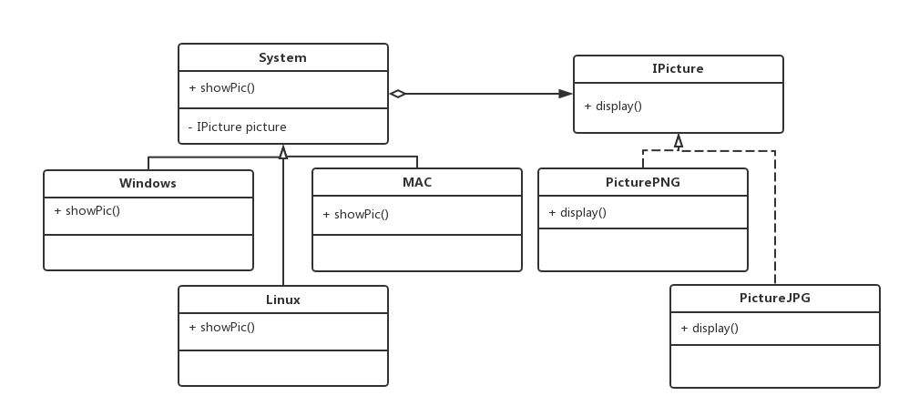

[Bridge.kt](/src/com/huangyu/bridge/Bridge.kt)
---

组合：
组合模式是对树形结构的处理，让调用者忽视单个对象和组合结构的差异。

[Composite.kt](/src/com/huangyu/composite/Composite.kt)
---

装饰：
装饰模式可以给一个对象添加额外的行为，在Kotlin下可以用扩展函数实现。

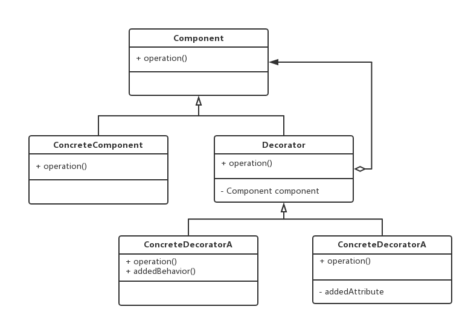

[Decorator.kt](/src/com/huangyu/decorator/Decorator.kt)
---

外观：
外观模式是为一个复杂的子系统提供一个简化的统一接口。

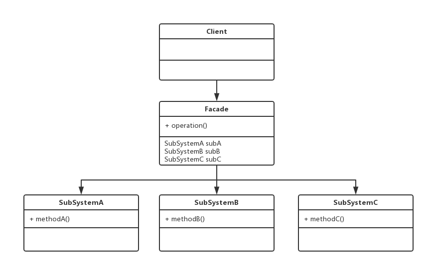

[Facade.kt](/src/com/huangyu/facade/Facade.kt)
---

享元：
享元模式以共享的方式高效地支持大量细粒度对象的重用，享元对象能做到共享的关键是区分了可共享内部状态和不可共享外部状态。

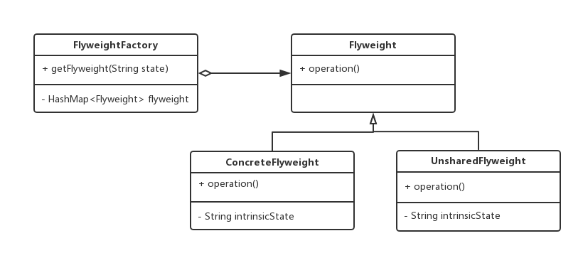

[FlyWeight.kt](/src/com/huangyu/flyweight/FlyWeight.kt)
---

代理：
代理模式是使用一个代理对象来访问目标对象的行为。

[Proxy.kt](/src/com/huangyu/proxy/Proxy.kt)
---

责任链：
职责链模式通过建立一条链来组织请求的处理者，请求将沿着链进行传递。

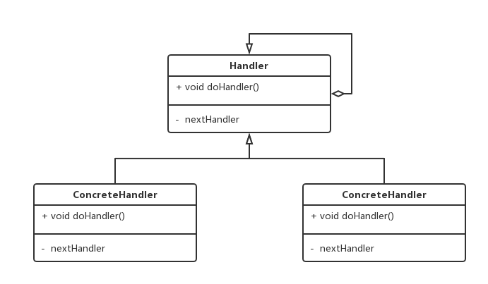

[ChainReponsibility.kt](/src/com/huangyu/chainreponsibility/ChainReponsibility.kt)
---

命令：
命令模式是将请求封装为命令对象，解耦请求发送者与接收者，对请求排队或者记录请求日志，以及支持可撤销的操作。

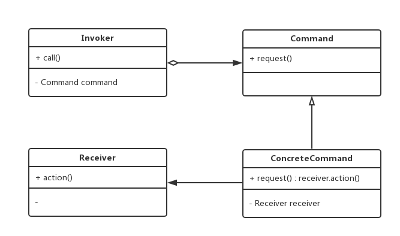

[Command.kt](/src/com/huangyu/command/Command.kt)
---

解释器模式：
解释器模式是定义一个语言的文法，并且建立一个解释器来解释该语言中的句子，这里的“语言”是指使用规定格式和语法的代码。

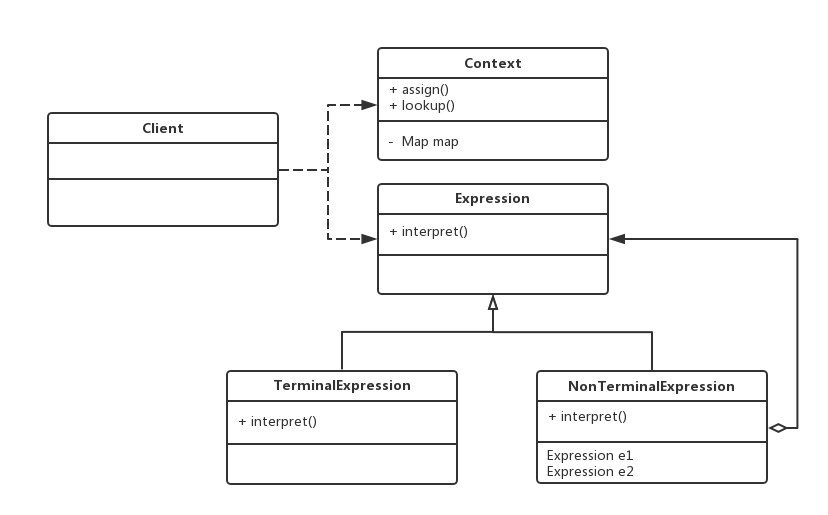

[Interpreter.kt](/src/com/huangyu/interpreter/Interpreter.kt)
---

迭代器：
迭代器模式提供一种不暴露底层实现情况下的遍历聚合对象中的元素的一种方式。

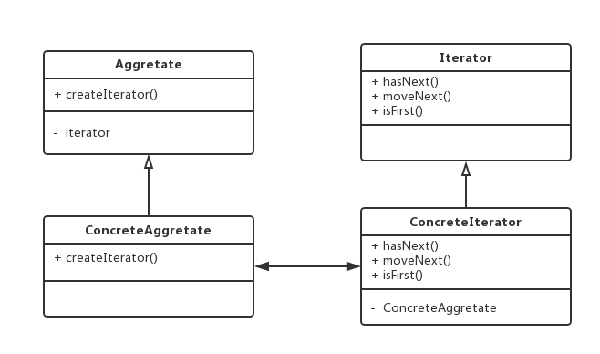

[Iterator.kt](/src/com/huangyu/iterator/Iterator.kt)
---

中介者：
中介者模式用一个中介对象（中介者）来封装一系列的对象交互，中介者使各对象不需要显式地相互引用，从而使其耦合松散，而且可以独立地改变它们之间的交互。

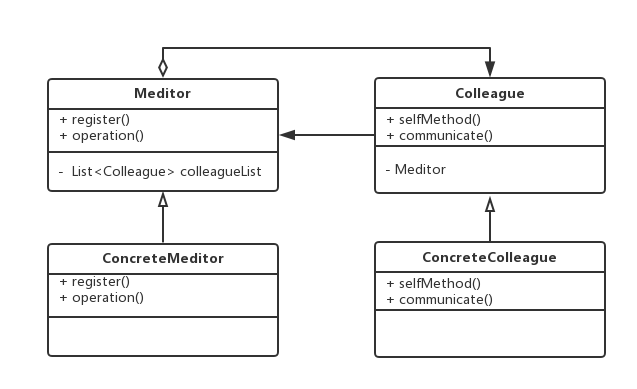

[Mediator.kt](/src/com/huangyu/mediator/Mediator.kt)
---

备忘录：
备忘录模式是在不破坏封装的前提下，捕获一个对象的内部状态，并在该对象之外保存这个状态，这样可以在以后将对象恢复到原先保存的状态。

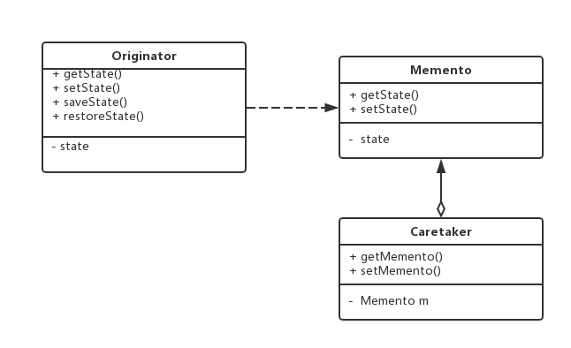

[Memento.kt](/src/com/huangyu/memento/Memento.kt)
---

观察者：
观察者模式是一个对象状态发生变化后，可以立即通知已订阅的另一个对象。

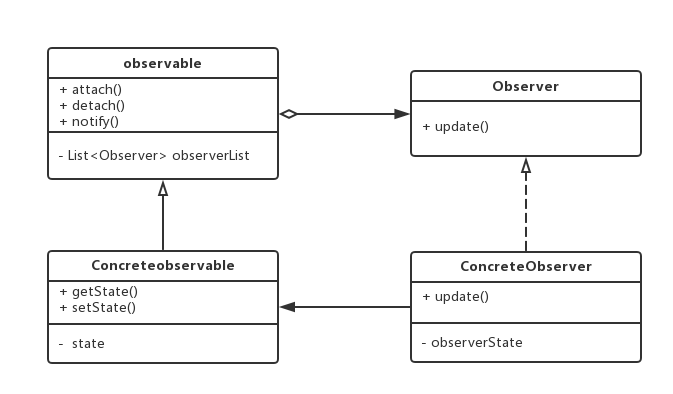

[Observer.kt](/src/com/huangyu/observer/Observer.kt)
---

状态模式
状态模式将一个对象在不同状态下的不同行为封装在一个个状态类中，通过设置不同的状态可以让对象拥有不同的行为。

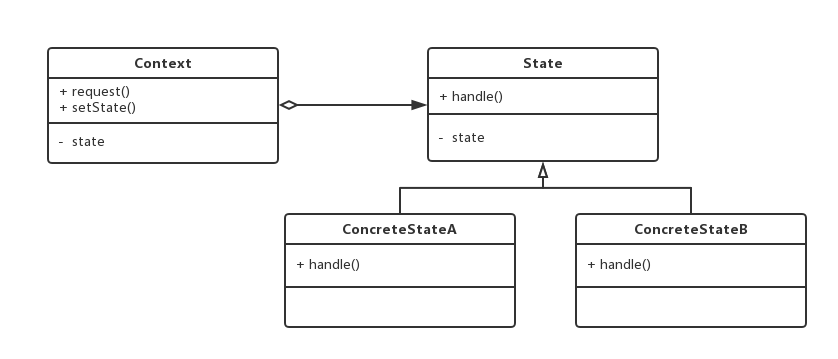

[State.kt](/src/com/huangyu/state/State.kt)
---

策略模式
策略模式用于算法的自由切换和扩展，分离算法的定义与实现，在 Kotlin 中可以使用高阶函数作为算法的抽象。

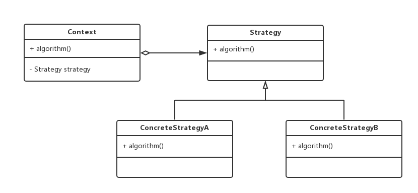

[Strategy.kt](/src/com/huangyu/strategy/Strategy.kt)
---

模版方法
模板方法模式提供了一个模板方法来定义算法框架，而某些具体步骤的实现可以在其子类中完成，Kotlin 中使用高阶函数可以避免继承的方式。

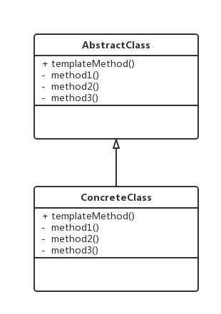

[Template.kt](/src/com/huangyu/template/Template.kt)
---

访问者
访问者模式提供一个作用于某对象结构中的各元素的操作表示，它使我们可以在不改变各元素的类的前提下定义作用于这些元素的新操作。

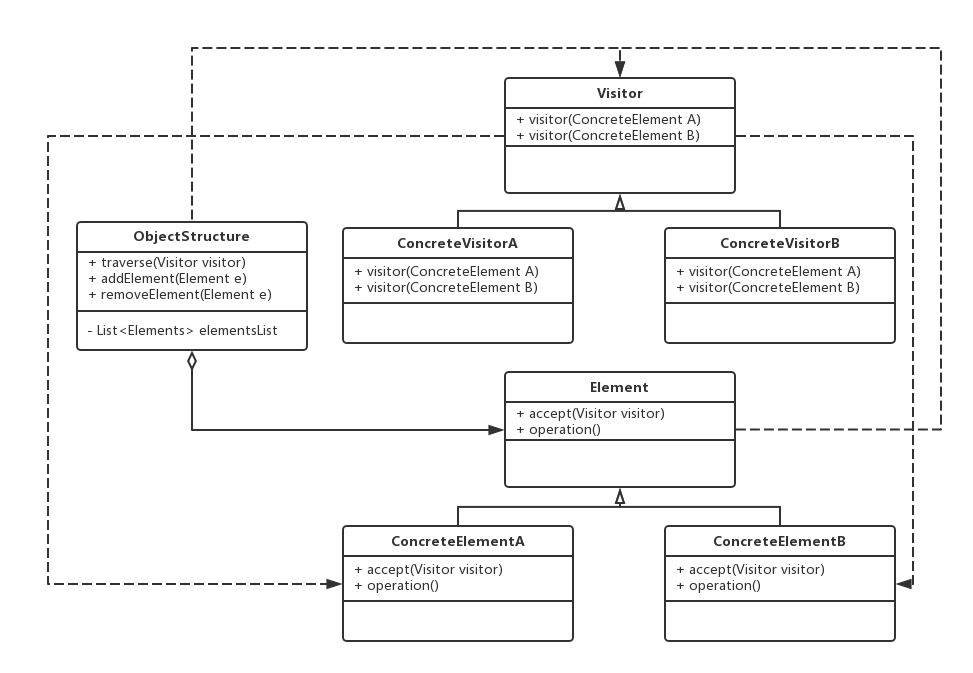

[Visitor.kt](/src/com/huangyu/visitor/Visitor.kt)
---

